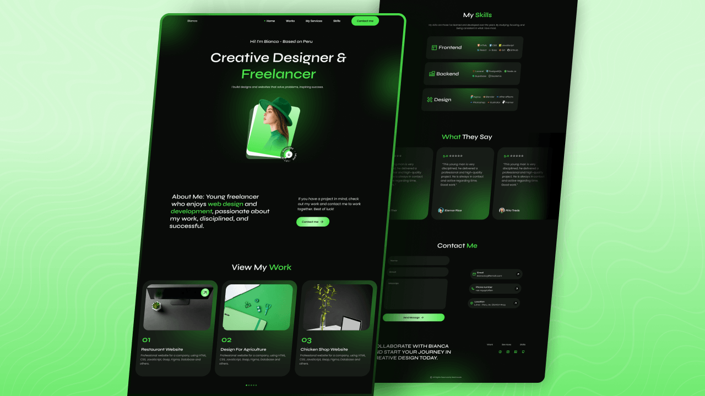

# Rabindra - Modern Responsive Portfolio Website

A modern, high-performance, and fully responsive portfolio website built with HTML5, CSS3 (Custom Properties & Flexbox/CSS Grid), and JavaScript.

## 📌 Features
- **Responsive Layout**: Designed mobile-first, adapting seamlessly from smartphones to 4K displays.
- **Dynamic Typing Animation**: Powered by Typed.js.
- **Interactive Work Carousel**: Swiper.js integration with touch swipe and custom pagination.
- **Collapsible Services**: Interactive accordion cards with smooth transitions.
- **Infinite Testimonial Marquee**: Seamless auto-scrolling testimonial slider with hover-to-pause.
- **Glassmorphism & Neon Glow**: Modern dark UI aesthetic with customizable CSS HSL color modes.
- **ScrollReveal Animations**: Smooth entrance triggers on scroll.
- **Contact Form**: Integrated contact form with feedback alerts.

## 🚀 Live Demo & Deployment
- Deploy easily to **Render**, **Vercel**, **Netlify**, or **GitHub Pages**.

## 🛠️ Built With
- **HTML5** (Semantic structure)
- **CSS3** (CSS Variables, Flexbox, Grid, Keyframe Animations)
- **JavaScript (ES6+)**
- **Libraries**:
  - [Remix Icon](https://remixicon.com/)
  - [Swiper JS](https://swiperjs.com/)
  - [Typed.js](https://github.com/mattboldt/typed.js/)
  - [ScrollReveal](https://scrollrevealjs.org/)
  - [EmailJS](https://www.emailjs.com/)

---
Designed & developed with ❤️ by **[Rabindra](https://github.com/Rabindra720)**.
 
